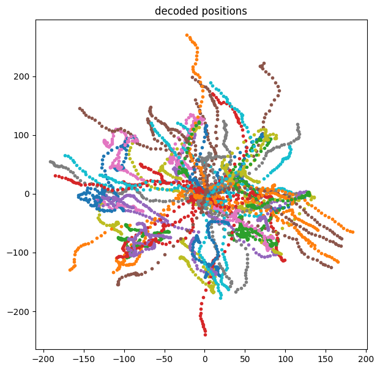

# Application of Kalman Filter in Neural Signal Decoding

**Hongchang Kuang**
**Words count: 1873 (excluding individual Latex formula and HTML code)**

## Introduction
In recent decades, as technology advancing and social ethics system maturing, a
heated debate has been triggered over the usage of Brain Machine Interface (BMI).
Some argues that current innovations are still not applicable for widely marketing
products. However, most engineers and neuroscientists are excited by technological
progress that facilitates brain mapping, the most sanguine of them comparing their
growing ability to tremendous advances that led to the unimaginable success of 
the BMI projects. Companies like NeuralLink and Paradromics, as well as government
agency have invested on the projects to test the possibilities and work on the
real world applications. This articles briefly introduces one of the prevailing 
technology in BMI: the application of Kalman filter in neural signal decoding, 
discussing its advantages and potential improvements.

## Backgrounds in Neuroscience
The main study theme of neuroscience is to link molecules to mind. Human brain is 
a highly integrated network of approximately 100 billion individual nerve cells. 
Therefore, to fully understand the mechanism behind the BMI devices, a brief 
understanding of how neurons are organized into signaling pathways and how they
communicated is necessary. We will introduce how brain functions from three different
levels: brain, neuron, and neural signal (action potential). Further readings in
related areas are also encouraged. 

### The Brain and Behavior
The central nervous system (CNS) is bilateral and symmetrical. Studies on brain
with modern imaging techniques discovers that different regions on brain are
specialized for different functions. For BMI, the most important part that we would 
like to focus on is the cerebral cortex, where brain operations that are responsible 
for human cognitive abilities occur. It consists of four anatomically distinct lobes 
with different functionalities, including planning future actions, hearing, learning,
vision, etc. As the concept of functional engineering prevails in neuroengineering,
it is natural to focus on a specific area on cerebral cortex to gather information 
of neuron activity. In our case, we will mainly focus on motor cortex in frontal 
lobe, which is responsible for planning future actions and the control of movement.

### Neurons
Nerve cells (neurons) are the basic units of the brain. Just like VLSI transistors,
Even though they have relatively basic morphology and architecture, approximately
10^11 neurons in the brain can support complex anatomical circuits, where the
"complexity" arises from. Neuron have four regions: cell body (soma), dendrites, 
axon, and presynaptic terminals. Axon is what we should pay special attention to:
it conveys signals (action potential) to other neurons in long distance (0.1mm - 
3m), while ensure the signals propagate without distortion or failure and preserving 
its shape at very high speed (1 - 100m/s). Two neurons can also communicate at the
synapse chemically using neurotransmitters.

### Neural Signal (Action Potential)
Action potentials are the signals by which brain receives, analyzes and conveys
information. Even though they are highly stereotyped just like digital signal (0 
and 1), they are able to convey all the information that the brain may need, 
including vision, audition, emotion, etc. However, since they do not have
distinguishable shapes, all the information is preserved in the path that the 
signal travels and pattern of action potentials. On the other hand, it is also 
their highly stereotyped shape makes decoding them feasible. The maximum magnitude 
of action potential can be up to 40 mV, and their frequency is about 500 Hz. Just 
like displacement and velocity, in neural signal decoding, we are more interested 
in the "velocity" of action potential: firing rate, which is the number of spikes 
of action potentials per unit time.

## Methods

### Motor Prothesis Concept
As shown in the graph, the whole BMI system consists of multiple components, 
including signal detection, decode algorithm, and feedback. In this section, we will
focus on continuous decoding of neural signal in hand movement (motor prosthesis). 
Image that you would like to grab the water bottle on the table. Your brain will 
go over two stages: planning and movement. In the planning stage, it need to plan 
the according trajectories precisely. In the following movement activity, it also 
needs to control the acceleration and speed of your arm. In general, the movement 
activity follows the plan activity, and is specially tuned for direction and speed of
arm movement. As a result, we will be mainly concerned with the neural movement 
activity and the corresponding kinematics like hand position, velocity, acceleration,
etc.

### Decoding Data and Notation
We first set up the following experimental context: a monkey is asked to perform a 
task. It needs to move its hand to the cursor on the screen. When the cursor appears,
it cannot move. As soon as it disappear, the monkey should move its hand to the
destination. We call this whole process a **reach**.

Apparently, for the reaching task, we have two sources of data to consider:

1. Observed kinematics (dimensionality $M$):

$$
x_k = \begin{bmatrix}
p^x_k \\
p^y_k \\
v^x_k \\
v^y_k \\
1
\end{bmatrix}
$$

$p^x_k $ and $p^y_k $ represent the position of hand at time $k$ (for $x$ and $y$
coordinates). Respectively, $v^x_k $ and $v^y_k $ represent the $x$ and $y$ velocity
of hand at time $k$. We ignore the acceleration and add a $1$ to the end for
calculation simplicity and matching the dimension.

2. Neural activity (dimensionality $N$)

$$
y_k = \begin{bmatrix}
y^1_k \\
y^2_k \\
\vdots \\
y^N_k \\
1 \\
\end{bmatrix}
$$

$y^n_k $ represents the neuron n's firing rate at time k. In our case $N = 96$, which
means that we decode neural signals from 96 neurons at the same time. We add a $1$ to
the end for calculation simplicity and matching the dimension.

We will further denote the decoded kinematics as $\hat{X}_k$. For convenience, for 
the total period of time of these activities, we can also define:

$$X = \begin{bmatrix} x_1 & x_2 & \ldots & x_K \end{bmatrix}$$

$$Y = \begin{bmatrix} y_1 & y_2 & \ldots & y_K \end{bmatrix}$$

where K is the total number of data points. If the time interval between two points 
is $\Delta t$, thus the total period of time of these activity will be $\tau =
K\Delta t$.

### General Ideas in Decoding
The general idea of the decoding operation is straightforward: decode th kinetics 
information from neural activities, which means to infer $X$ from $Y$.

One simple method is that, if we could assume that their relation is linear, we can 
simply fit a line to them using **least square** since we have both observed data 
for $X$ and $Y$:

$$ X = LY $$

Basically is to minimize:

$$ \frac{1}{2} \sum_{k=1}^{K} ||x_k - Ly_k||^2 $$

With our knowledge in linear algebra, we get:

$$ L = XY^T(YY^T)^{-1} $$

No we have this $L$. Concretely, say that we have a new neural signal data
$\widetilde{y}_k$, then we can decode the kinetics $\hat{x}_k$ using:

$$ \hat{x}_k = L\widetilde{y}_k $$

This is what we called **Optimal Linear Estimator** (OLE). Unfortunately, as you may
guess, its accuracy and robustness are not very ideal. Obviously, we have ignore 
something in this case. First, for the adjacent positions, say $x_n$ and $x_{n+1}$,
there must be some relation between them; second, even though we introduce the 
concept of velocity, we did not apply any physics law to exploit them.

The first problem seems easy to solve, we can simply take history into account
by doing something like:

$$ x_k =  \sum_{p=0}^{P} L_py_{k-p} $$

Rewrite it in matrix form:

$$ X_w = L_wY_w$$

We can find $L_w$ using least square as well:

$$ L_w = X_wY_w^T(Y_wY_w^T)^{-1} $$

This technique is called **Wiener Filter**. We enhance the OPE by considering data 
from the history. If we would like to solve the second problem at the same time, 
it's finally time to welcome **Kalman Filter** to the stage.

### Decoding with Kalman Filter
The main concern is, we have additional information we have not used in our
decoding process: the law of physics, since we understand the the position of the 
arm is the integration of its velocity. The natural way to incorporate this is 
Kalman Filter.

If we add one more equation to the original OLE, we can get:

$$ x_{k+1} = Ax_k $$
$$ y_k = Cx_k $$

The first equation is called **state update process** or **dynamic process**, where 
$x_k$, the kinematics of the hand, is the state. $A$ is the **dynamic matrix** 
where we can encode the law of physics. The second equation is **observation 
process**. $y_k$ is just the observation of neural signal. This inverse OLE equation
helps us link the neural signal $y_k$ and kinematics $x_k$. These two equations 
together is called **Linear Dynamical System**.

In real life, we have to add some random noise to them:

$$ x_{k+1} = Ax_k + w_k $$
$$ y_k = Cx_k + q_k $$

We can simply assume that they are gaussian noise, with zero mean and covariance 
matrix $W$ and $Q$:

$$ w_k \sim \mathcal{N}(0, W) $$
$$ q_k \sim \mathcal{N}(0, Q) $$

So how do we get the optimal estimator of $\hat{x}_k$ from those two equations? 
Under certain assumption (linearity and gaussian noise), there is a recursive 
solution to this called **Kalman Filter**

The spoiler is, we will reach to some equation like this: 

$$ \hat{x}_k = M_1\hat{x}_{k-1} + M_2y_k $$

Apparently, we take all factors into account: history, law of physics, and the 
neural signal. All of them have some information of what the newly decoded data 
should be. So the goal is to find two matrices $M_1$ and $M_2$. They are the 
function of $A$, $C$, $W$, $Q$.

What is Kalman Filter actually doing? In one dimension, we need to find an estimator

$$ \hat{x}_{k|1,\ldots,k} = \mathbb{E}(x_k|y_1,\ldots,y_k) $$

In other words, this means "we want to find the expected value of $x$ at time $k$ 
given all my observations of $y$ from time $1$ to $k$". We also need to know the 
variance of it to estimate how much we trust this value (in multi-dimension this 
will be $\Sigma$):

$$ \sigma^2_{k|1,\ldots,k} = \text{Var}(x_k|y_1,\ldots,y_k) $$

In general, we would write the distribution of $x_k|y_1,\ldots,y_k$ and then just 
take its expected value. This seems to be difficult, but we have a recursive
solution provided by Kalman Filter. We will ignore the derivation of it here. The 
process will be:

1. Initialize: $\Sigma_{0|0} = 0$

2. Estimation updated process: Recursively calculate, until convergence of $K_k$:

$$ \Sigma_{k|k-1} = A\Sigma_{k-1|k-1}A^T + W $$
$$ \Sigma_{k|k} = \Sigma_{k-1|k-1} - \Sigma_{k-1|k-1}C^T(C\Sigma_{k-1|k-1}C^T)^{-1}C\Sigma_{k-1|k-1} $$
$$ K_k = \Sigma_{k-1|k-1}C^T(C\Sigma_{k-1|k-1}C^T)^{-1} $$

We called the converged value $\Sigma_\infty$ and $K_\infty$, and $K_k$ is called 
the **Kalman Gain**

After some more magic, we can calculate $M_1$ and $M_2$ by 

$$ M_1 = A - K_\infty CA $$
$$ M_2 = K_\infty $$

What about $A$, $C$, $W$, $Q$ themselves? We need to calculate them using 
**maximum likelihood** method in machine learning. What we need to do is to maximize
the following likelihood with parameters set $\theta$:

$$ L = P((x_k, y_k)^K_{k=1} | \theta = \{A, W, C, Q\}) $$

We can do this by taking the derivative of logarithm of $L$ with respective to $A$, 
$C$, $W$, $Q$. Then simply set it to zero. What we will finally get is:

$$ A = X_{:,2:end}X_{:,1:end-1}^{\dagger} $$
$$ C = YX^{\dagger} $$
$$ W = \frac{1}{K-1}(X_{:,2:end} - AX_{:,1:end-1})(X_{:,2:end} - AX_{:,1:end-1})
^T $$
$$ Q = \frac{1}{K}(Y - CX)(Y - CX)^T $$

We also need to make sure that $A$ obeys law of physics. With all these parameters, 
we should be able to decode $\hat{x}_k$ using the formula we first propose. The final 
results of the decoding is shown in the graph below. On its right is the actually 
movement of all the reach in the experiment marked by different colors, where x and 
y axis represent the coordinates of hand positions.

    
    

## Conclusion
When it comes to decode neural signal, Kalman Filter is a powerful technique which 
incorporates factors like history, law of physics, and the neural data into the 
decoding process. It presents ideal accuracy and robustness. Nevertheless, it also 
has some drawbacks. Kalman Filter can easily experience overshoot since it may weight
too heavily on the history. Some potential improvements include rotating the velocity 
toward the destination (take angles into consideration) or use **Closed Loop Decoder
Adaptation** (CLDA). In modern decoder with more advanced features, **Deep Neural 
Network** is also widely used.

## References
Principles of Neural Science, Fourth Edition. Eric R. Kandel, James H. Schwartz, 
Thomas M. Jessell

Slides from EC ENGR C143A "Neural Signal Processing" by professor Jonathan Kao